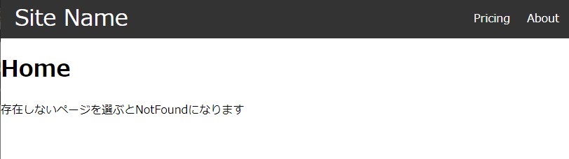

# Router Tutorial



## バージョン
React Router v6

```
$ npm install --save react-router-dom
```

```Javascript
import { Link } from "react-router-dom";

//aタグとほぼ同じ
<Link to={'/home'}>Home</Link>
```
```Javascript
import Navbar from "./components/Navbar";
import { Route, Routes } from "react-router-dom";
import Home from "./Pages/Home";
import About from "./Pages/About";
import Pricing from "./Pages/Pricing";
import NotFound from "./Pages/NotFound";

function App() {
  return (
    <div className="App">
      <Navbar />

      <div className="container">
        <Routes>
          <Route path="/" element={<Home />} />
          <Route path="/pricing" element={<Pricing />} />
          <Route path="/about" element={<About />} />
          <Route path="/*" element={<NotFound />} />
        </Routes>
      </div>
    </div>
  );
}

export default App;
```

